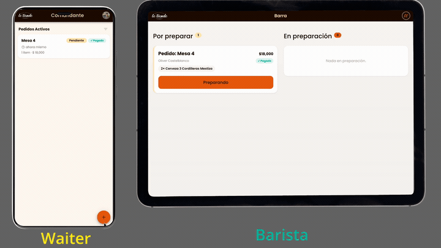
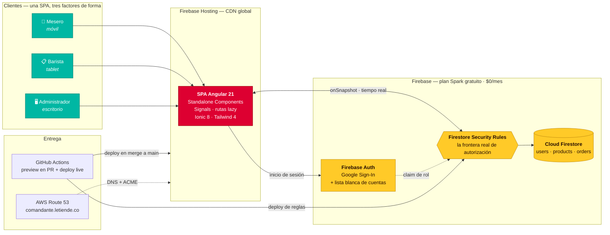
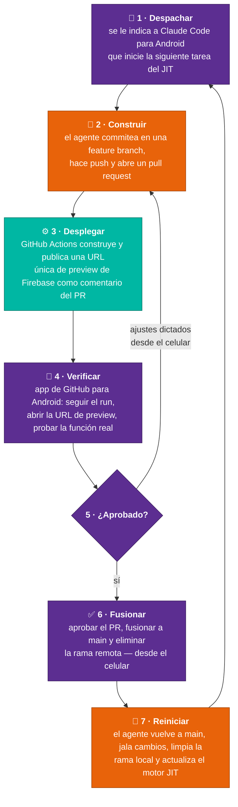

<div align="center">

# Comandante

**Un sistema de punto de venta en producción para un centro cultural — arquitecturado mediante orquestación de agentes de IA, ~60% dirigido desde un celular, operando a $0 USD/mes.**

[](https://comandante.letiende.co)
[](https://angular.dev)
[](https://firebase.google.com)
[](#arquitectura-de-costo-cero)
[](#orquestado-desde-un-celular)
[](./README.md)

<br/>



<sub><b>Flujo de pedido en tiempo real.</b> Izquierda: el mesero cierra un pedido en el celular. Derecha: la tablet del barista lo recibe al instante — sin polling, sin recargar página, sin papel.</sub>

</div>

---

## Resumen Ejecutivo

> **Un sistema en producción entregado en 6 días calendario, operando a $0 USD/mes.**

Comandante reemplazó las comandas en papel y la comunicación a gritos en **Le Tiende** — librería, café bar y centro cultural en Bogotá, Colombia. Cubre cuatro roles operativos, sincronización de pedidos en tiempo real, cálculo de discriminación de propina para datáfonos, autenticación, CI/CD y dominio propio.

| | |
| :-- | :-- |
| **Time-to-market** | **6 días** — primer commit `2026-05-22` → Fase 1 en producción `2026-05-27` |
| **OPEX mensual** | **$0 USD** — íntegramente dentro del plan gratuito Spark de Firebase |
| **Superficie de orquestación** | **~60% dirigido desde un celular Android** — despacho, revisión y merge, en movimiento |
| **Metodología** | AI-Augmented SDLC — orquestación de agentes como método principal de producción |
| **Cadencia de entrega** | 96 commits · 19 pull requests revisados · ~3.400 LOC |
| **Humano en el ciclo** | 100% de los merges a `main` revisados y aprobados por un humano |

El punto no es que la IA escribió código. El punto es que **un arquitecto de soluciones usando orquestación de agentes comprimió el ciclo de vida completo** — requisitos, arquitectura, especificación, implementación, revisión de seguridad y despliegue — a una fracción del tiempo de entrega convencional, bajo restricciones reales de costo y seguridad, sin renunciar a la disciplina de revisión.

Y la estación de trabajo dejó de ser el cuello de botella: cerca del **60% de este sistema — frontend, capa de datos y todo el ciclo de ajustes finales — se dirigió desde un celular**, sin terminal, sin IDE y sin portátil de por medio. [Ver el loop ↓](#orquestado-desde-un-celular)

---

## El Problema

En un local con eventos en vivo, el flujo era: el mesero escribe en papel → camina hasta la barra → lee el pedido en voz alta → el barista lo memoriza → el cobro en el datáfono se calcula mentalmente, mezclando consumo gravado con propina voluntaria. Los modos de falla eran predecibles: comandas perdidas, pedidos mal escuchados y fricción contable en cada cierre de jornada.

## La Solución

Una única SPA responsiva que se adapta a tres clases de dispositivo y cuatro roles, con Firestore como columna vertebral en tiempo real.

### Mesero — Mobile First
Interfaz táctil ultraligera pensada para iluminación baja y alta demanda. Seleccionar del catálogo, etiquetar el pedido con una palabra clave del cliente, cerrar la comanda con un solo gesto.

### Discriminación de propina para datáfonos
El sistema calcula y muestra a pantalla completa los montos separados de **consumo gravado** y **propina voluntaria** (exenta de IVA), listos para digitar en el datáfono sin integrar ninguna API de pagos. Elimina la aritmética mental en el momento del cobro y la conciliación contable que venía después.

### Sincronización en tiempo real
Las comandas cerradas llegan a la barra instantáneamente vía Cloud Firestore. La preparación inicia *antes* de confirmar el pago — crítico en eventos tipo discoteca donde el flujo de caja es continuo.

### Barista — Tablet
Cola cronológica de pedidos en preparación, identificados por mesero y palabra clave. El barista controla el estado de entrega y el estado de pago desde una pantalla dedicada.

### Administrador — Desktop
Consolidado de ventas diarias estructurado para el asentamiento manual en el POS existente del establecimiento. Reporte detallado por pedido con medio de pago (tarjeta / efectivo / Nequi / Daviplata) y filtros por rango de fecha y hora.

### Roles dinámicos por jornada
Google Sign-In contra una lista blanca de cuentas autorizadas. El administrador asigna y rota los roles (*Mesero*, *Barista*, *Administrador*, *Inactivo*) al inicio de cada turno — sin tocar código ni redesplegar.

---

## Arquitectura



**La decisión estructural:** no existe capa de backend. Los guards de Angular son solo UX — el control de acceso *real* vive en las Firestore Security Rules, evaluadas del lado del servidor en cada lectura y escritura. Eliminar el backend intermedio eliminó de un solo movimiento su superficie de ataque, su costo de hosting y su pipeline de despliegue.

---

## Arquitectura de Costo Cero

| Servicio | Plan | Costo mensual |
| :--- | :--- | ---: |
| Firebase Hosting | Spark | $0 |
| Cloud Firestore | Spark — 50 K lecturas/día | $0 |
| Firebase Authentication | Spark — 10 K verificaciones/mes | $0 |
| GitHub Actions | Plan gratuito (repo público) | $0 |
| DNS del dominio (`comandante.letiende.co`) | AWS Route 53 | ~$0.50 |

**Por qué esta es una decisión de arquitectura, no de presupuesto:**

- **Sin infraestructura que operar.** Sin servidores, sin contenedores, sin orquestación. El hosting sirve la SPA desde una CDN global automáticamente.
- **Escalabilidad reactiva.** Firestore escala con el tráfico; en días sin eventos el costo es *literalmente* cero — no hay recursos ociosos facturando.
- **Seguridad en el perímetro correcto.** Las Security Rules son la única fuente de verdad de autorización, evaluadas del lado del servidor y versionadas en el repositorio junto al código que depende de ellas.
- **La cuota gratuita es el techo de gasto.** El límite de 50 K lecturas/día actúa como circuit breaker natural contra explosiones de consumo — un incidente de costo degrada a incidente de servicio, nunca a una factura sorpresa.
- **Disciplina de consumo como regla de código.** La desuscripción sistemática de `onSnapshot` al desmontar componentes y el caché local del catálogo vía Signals son convenciones obligatorias del proyecto, no ocurrencias tardías. El polling manual está prohibido.

---

## AI-Augmented SDLC

Comandante no se construyó con IA como asistente de autocompletado. La orquestación de agentes fue **el método principal de producción**, aplicado a lo largo de todo el ciclo de vida.

| Fase del ciclo de vida | Cómo se ejecutó |
| :--- | :--- |
| **Requisitos** | Agentes de entrevista estructurada trabajando directamente contra las restricciones del operador del negocio |
| **Arquitectura** | Diseño iterativo validado contra límites duros de costo y operación antes de escribir código |
| **Especificación** | [`PRD.md`](./PRD.md) y [`tech-specs.md`](./tech-specs.md) generados y mantenidos como artefactos vivos |
| **Implementación** | Delegada a agentes ejecutores, acotada a tareas atómicas por un backlog JIT con límite de WIP de 2 |
| **Verificación** | Agentes revisores independientes — el agente que escribe el código nunca lo aprueba |
| **Seguridad** | Reglas mapeadas a OWASP codificadas como restricciones permanentes del proyecto en [`CLAUDE.md`](./CLAUDE.md) |
| **Git flow** | Impuesto por política: los agentes tienen prohibido estructuralmente hacer push a ramas protegidas |

**Los guardarraíles que hicieron segura la velocidad.** Velocidad sin disciplina produce código no revisable. Tres restricciones lo mantuvieron honesto:

1. **Ningún agente fusiona su propio trabajo.** Cada uno de los 19 pull requests fue revisado y fusionado por un humano.
2. **Las restricciones viven en el repositorio.** [`CLAUDE.md`](./CLAUDE.md) codifica reglas de seguridad, convenciones de código y política de git como instrucciones permanentes y versionadas — así el contexto sobrevive entre sesiones y entre agentes.
3. **Planificación JIT con límite de WIP de 2.** [`TODO.md`](./TODO.md) nunca contiene más de dos tareas atómicas. Sin backlog obsoleto, sin estimaciones caducas.

**El artefacto que compone.** [`CLAUDE.md`](./CLAUDE.md) acumula una sección de *Hallazgos Técnicos del Stack* — comportamientos no obvios descubiertos durante el desarrollo (Tailwind 4 solo lee configuración PostCSS desde JSON bajo el builder esbuild de Angular; `&&` retorna `bool` y no el último valor en Firestore Rules; `<ion-page>` no es un web component real de Ionic). Cada sesión de depuración se captura una vez y no se vuelve a litigar. Ese archivo es el verdadero entregable del método — el código es apenas su salida.

---

## Orquestado Desde un Celular

Cerca del **60% de este sistema se construyó sin abrir un portátil** — el frontend, la capa de datos y todo el ciclo de ajustes finales se dirigieron desde un celular Android, en movimiento, a cualquier hora.

No fue una curiosidad. Es lo que la arquitectura habilita: cuando el CI/CD se encarga de construir, desplegar y publicar una URL verificable, el trabajo que le queda al humano es **despachar, juzgar y aprobar** — tres cosas que caben en la pantalla de un celular.



<div align="center">
<sub>🟣 humano, desde el celular &nbsp;·&nbsp; 🟠 agente &nbsp;·&nbsp; 🟢 pipeline automatizado</sub>
</div>

**Las tres precondiciones que hacen funcionar este loop** — cada una una decisión de arquitectura tomada *antes* de la primera tarea:

1. **Un pipeline de CI/CD que produce un artefacto verificable, no solo un check verde.** El job `preview` en [`deploy-hosting.yml`](./.github/workflows/deploy-hosting.yml) despliega cada pull request a un canal único de Firebase Hosting y comenta la URL de vuelta en el PR. Verificar se reduce a *tocar un enlace* — el único paso que genuinamente no podría hacerse desde un celular de otra forma.
2. **Un backlog que sostiene el estado para que el operador no tenga que hacerlo.** Con el motor JIT de [`TODO.md`](./TODO.md) limitado a dos tareas atómicas, "inicia la siguiente tarea" es una instrucción sin ambigüedad. Nada de contexto que reconstruir, ningún plan que recordar.
3. **Restricciones codificadas en el repositorio, no en el prompt.** [`CLAUDE.md`](./CLAUDE.md) carga las reglas de seguridad, las convenciones de código y la política de git. El agente llega pre-restringido, así que una instrucción de tres líneas escrita con el pulgar produce la misma disciplina que un briefing completo.

**Por qué esto importa más allá de la anécdota.** El cuello de botella en la entrega de software nunca fue la velocidad de tecleo — fue la serialización de *decidir → implementar → verificar* en un solo asiento frente a una sola máquina. Al empujar la implementación hacia los agentes y la verificación hacia el pipeline, lo que le queda al humano es justamente la parte que siempre requirió un humano. La estación de trabajo se vuelve opcional; el criterio no.

---

## Stack Tecnológico

| Capa | Tecnología |
| :--- | :--- |
| Framework frontend | Angular 21.2 — Standalone Components, Signals, rutas lazy |
| UI móvil | Ionic Framework (Angular) 8.x |
| Estilos | Tailwind CSS 4.x con tokens semánticos `@theme` |
| Base de datos / tiempo real | Cloud Firestore (Firebase SDK v10+) |
| Autenticación | Firebase Authentication — Google Sign-In |
| Hosting / CDN | Firebase Hosting |
| CI/CD | GitHub Actions — canales de preview en PR + deploy live en merge |
| DNS | AWS Route 53 |
| Lenguaje | TypeScript en modo `strict` — `any` está prohibido |

---

## Ejecutar en Local

```bash
git clone https://github.com/ocastelblanco/comandante-letiende.git
cd comandante-letiende
npm install
npm start                                    # servidor de desarrollo en localhost:4200
```

```bash
npm test                                     # pruebas unitarias
npm run build -- --configuration=production  # build de producción
```

Las llaves de cliente de Firebase se cargan desde `src/environments/`. Las credenciales de cuentas de servicio nunca se versionan.

---

## Documentación del Proyecto

| Documento | Contenido |
| :--- | :--- |
| [`PRD.md`](./PRD.md) | Visión del producto, perfiles de usuario, casos de uso y objetivos comerciales |
| [`tech-specs.md`](./tech-specs.md) | Arquitectura Firestore, configuración DNS, reglas de seguridad |
| [`CLAUDE.md`](./CLAUDE.md) | Instrucciones permanentes para agentes IA: código, seguridad, git flow y gotchas del stack |
| [`DESIGN.md`](./DESIGN.md) | Sistema de diseño, tokens de color y convenciones de UI |
| [`TODO.md`](./TODO.md) | Backlog JIT — las dos próximas tareas atómicas, más el historial completo de tareas terminadas |

---

<div align="center">
<sub>Construido para <b>Le Tiende</b> — librería, café bar y centro cultural · Bogotá, Colombia</sub>
</div>
