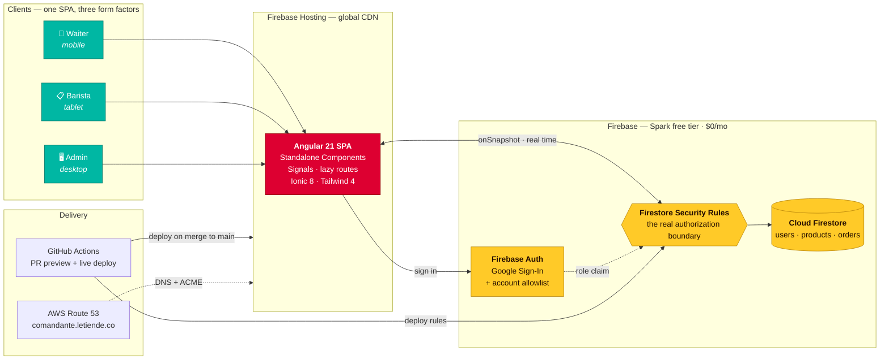
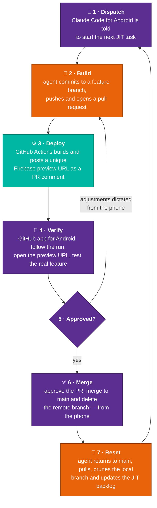

<div align="center">

# Comandante

**A production point-of-sale system for a cultural venue — architected through AI agent orchestration, ~60% of it directed from a phone, running at $0 USD/month.**

[](https://comandante.letiende.co)
[](https://angular.dev)
[](https://firebase.google.com)
[](#zero-cost-architecture)
[](#orchestrated-from-a-phone)
[](./README.es.md)

<br/>


<sub><b>Real-time order flow.</b> Left: waiter closes an order on a phone. Right: the barista's tablet receives it instantly — no polling, no page reloads, no paper.</sub>

</div>

---

## Executive Summary

> **A production system shipped in 6 calendar days, running at $0 USD/month.**

Comandante replaced paper order slips and verbal shouting at **Le Tiende** — a bookstore, café bar and cultural venue in Bogotá, Colombia. It handles four operational roles, real-time order synchronization, tip/tax split calculation for card terminals, authentication, CI/CD and a custom domain.

| | |
| :-- | :-- |
| **Time-to-market** | **6 days** — first commit `2026-05-22` → Phase 1 in production `2026-05-27` |
| **Monthly OPEX** | **$0 USD** — entirely within Firebase's free Spark tier |
| **Orchestration surface** | **~60% directed from an Android phone** — dispatch, review and merge, in motion |
| **Method** | AI-Augmented SDLC — agent orchestration as the primary production method |
| **Delivery cadence** | 96 commits · 19 reviewed pull requests · ~3,400 LOC |
| **Human-in-the-loop** | 100% of merges to `main` reviewed and approved by a human |

The point is not that AI wrote code. The point is that **a solutions architect using agent orchestration compressed the full lifecycle** — requirements, architecture, specification, implementation, security review and deployment — into a fraction of conventional delivery time, under real cost and security constraints, without giving up review discipline.

And the workstation stopped being the bottleneck: roughly **60% of this system — frontend, data layer and the entire final-adjustment cycle — was directed from a phone**, with no terminal, no IDE and no laptop involved. [See the loop ↓](#orchestrated-from-a-phone)

---

## The Problem

At a venue running live events, the ordering flow was: waiter writes on paper → walks to the bar → reads the order aloud → barista memorizes it → the card terminal charge is calculated mentally, mixing taxable consumption with voluntary tips. The failure modes were predictable: lost slips, misheard orders, and accounting friction at closing time every single night.

## The Solution

A single responsive SPA that adapts to three device classes and four roles, with Firestore as the real-time backbone.

### Waiter — mobile first
Ultralight touch interface built for low light and high demand. Select from the catalog, tag the order with a customer keyword, close the order in one gesture.

### Tip & tax split for card terminals
The system computes and displays **taxable consumption** and **voluntary tip** (VAT-exempt) as separate full-screen amounts, ready to be keyed into a card terminal with no payment API integration. Eliminates mental math at the point of charge and the accounting reconciliation that followed it.

### Real-time sync
Closed orders reach the bar instantly over Cloud Firestore. Preparation starts *before* payment is confirmed — critical during club-style events where cash flow is continuous.

### Barista — tablet
Chronological queue of orders in preparation, identified by waiter and keyword. The barista drives delivery state and payment state from a dedicated screen.

### Admin — desktop
Daily sales consolidation structured for manual settlement into the venue's existing POS. Detailed per-order reporting with payment method (card / cash / Nequi / Daviplata) and datetime range filters.

### Shift-based dynamic roles
Google Sign-In against an allowlist of authorized accounts. The administrator assigns and rotates roles (*Waiter*, *Barista*, *Admin*, *Inactive*) at the start of each shift — no code changes, no redeployment.

---

## Architecture



**The load-bearing decision:** there is no backend tier. Angular route guards are UX only — the *actual* access control lives in Firestore Security Rules, evaluated server-side on every read and write. Removing the intermediate backend removed its entire attack surface, its hosting cost and its deployment pipeline in one move.

---

## Zero-Cost Architecture

| Service | Plan | Monthly cost |
| :--- | :--- | ---: |
| Firebase Hosting | Spark | $0 |
| Cloud Firestore | Spark — 50 K reads/day | $0 |
| Firebase Authentication | Spark — 10 K verifications/month | $0 |
| GitHub Actions | Free tier (public repo) | $0 |
| Domain DNS (`comandante.letiende.co`) | AWS Route 53 | ~$0.50 |

**Why this is an architecture decision, not a budget one:**

- **No infrastructure to operate.** No servers, no containers, no orchestration. Hosting serves the SPA from a global CDN automatically.
- **Reactive scaling.** Firestore scales with traffic; on days without events the cost is *literally* zero — no idle resources billing.
- **Security at the correct perimeter.** Security Rules are the single source of authorization truth, evaluated server-side and versioned in the repo alongside the code that depends on them.
- **The free quota is the spend ceiling.** The 50 K reads/day limit acts as a natural circuit breaker against runaway consumption — a cost incident degrades to a service incident, never to a surprise invoice.
- **Consumption discipline as a code rule.** Systematic `onSnapshot` unsubscription on component teardown and local catalog caching via Signals are enforced project conventions, not afterthoughts. Manual polling is banned.

---

## AI-Augmented SDLC

Comandante was not built with AI as an autocomplete assistant. Agent orchestration was **the primary production method**, applied across the entire lifecycle.

| Lifecycle phase | How it was executed |
| :--- | :--- |
| **Requirements** | Structured interview agents working directly against the business operator's constraints |
| **Architecture** | Iterative design validated against hard cost and operational limits before any code |
| **Specification** | [`PRD.md`](./PRD.md) and [`tech-specs.md`](./tech-specs.md) generated and maintained as living artifacts |
| **Implementation** | Delegated to executor agents, scoped to atomic tasks by a JIT backlog with a WIP limit of 2 |
| **Verification** | Independent reviewer agents — the agent that writes code never approves it |
| **Security** | OWASP-mapped rules encoded as permanent project constraints in [`CLAUDE.md`](./CLAUDE.md) |
| **Git flow** | Enforced by policy: agents are structurally forbidden from pushing to protected branches |

**Guardrails that made the speed safe.** Velocity without discipline produces unreviewable code. Three constraints kept it honest:

1. **No agent merges its own work.** Every one of the 19 pull requests was reviewed and merged by a human.
2. **Constraints live in the repo.** [`CLAUDE.md`](./CLAUDE.md) encodes security rules, code conventions and git policy as permanent, versioned instructions — so context survives across sessions and agents.
3. **JIT planning with a WIP limit of 2.** [`TODO.md`](./TODO.md) never holds more than two atomic tasks. No stale backlog, no obsolete estimates.

**The compounding artifact.** [`CLAUDE.md`](./CLAUDE.md) accumulates a *Technical Gotchas* section — non-obvious stack behaviors discovered during development (Tailwind 4 only reading PostCSS config from JSON under the Angular esbuild builder; `&&` returning `bool` rather than the last value in Firestore Rules; `<ion-page>` not being a real Ionic web component). Each debugging session is captured once and never re-litigated. That file is the actual deliverable of the method — the codebase is just its output.

---

## Orchestrated From a Phone

Roughly **60% of this system was built without opening a laptop** — the frontend, the data layer and the entire final-adjustment cycle were directed from an Android phone, in motion, at any hour.

This was not a novelty. It is what the architecture makes possible: when CI/CD owns building, deploying and publishing a verifiable URL, the human's remaining job is **dispatch, judgment and approval** — three things that fit on a phone screen.



<div align="center">
<sub>🟣 human, from the phone &nbsp;·&nbsp; 🟠 agent &nbsp;·&nbsp; 🟢 automated pipeline</sub>
</div>

**The three preconditions that make this loop work** — each one an architectural decision made *before* the first task:

1. **A CI/CD pipeline that produces a verifiable artifact, not just a green check.** The `preview` job in [`deploy-hosting.yml`](./.github/workflows/deploy-hosting.yml) deploys every pull request to a unique Firebase Hosting channel and comments the URL back on the PR. Verification becomes *tapping a link* — the one step that genuinely cannot be done from a phone otherwise.
2. **A backlog that holds state so the operator doesn't have to.** With the JIT engine in [`TODO.md`](./TODO.md) capped at two atomic tasks, "start the next task" is an unambiguous instruction. No context to reconstruct, no plan to remember.
3. **Constraints encoded in the repo, not in the prompt.** [`CLAUDE.md`](./CLAUDE.md) carries the security rules, code conventions and git policy. The agent arrives pre-constrained, so a three-line instruction typed with a thumb produces the same discipline as a full briefing.

**Why this matters beyond the novelty.** The bottleneck in software delivery was never typing speed — it was the serialization of *decide → implement → verify* into a single seat in front of a single machine. Push implementation to agents and verification to the pipeline, and what remains for the human is the part that actually required a human all along. The workstation becomes optional; the judgment does not.

---

## Tech Stack

| Layer | Technology |
| :--- | :--- |
| Frontend framework | Angular 21.2 — Standalone Components, Signals, lazy-loaded routes |
| Mobile UI | Ionic Framework (Angular) 8.x |
| Styling | Tailwind CSS 4.x with semantic `@theme` tokens |
| Database / real time | Cloud Firestore (Firebase SDK v10+) |
| Authentication | Firebase Authentication — Google Sign-In |
| Hosting / CDN | Firebase Hosting |
| CI/CD | GitHub Actions — PR preview channels + live deploy on merge |
| DNS | AWS Route 53 |
| Language | TypeScript, `strict` mode — `any` is banned |

---

## Running Locally

```bash
git clone https://github.com/ocastelblanco/comandante-letiende.git
cd comandante-letiende
npm install
npm start                                    # dev server at localhost:4200
```

```bash
npm test                                     # unit tests
npm run build -- --configuration=production  # production build
```

Firebase client keys are loaded from `src/environments/`. Service account credentials are never committed.

---

## Project Documentation

| Document | Contents |
| :--- | :--- |
| [`PRD.md`](./PRD.md) | Product vision, user profiles, use cases and business objectives |
| [`tech-specs.md`](./tech-specs.md) | Firestore architecture, DNS configuration, security rules |
| [`CLAUDE.md`](./CLAUDE.md) | Permanent AI agent instructions: code, security, git flow and stack gotchas |
| [`DESIGN.md`](./DESIGN.md) | Design system, color tokens and UI conventions |
| [`TODO.md`](./TODO.md) | JIT backlog — the next two atomic tasks, plus full completed-task history |

---

<div align="center">
<sub>Built for <b>Le Tiende</b> — bookstore, café bar and cultural venue · Bogotá, Colombia</sub>
</div>
